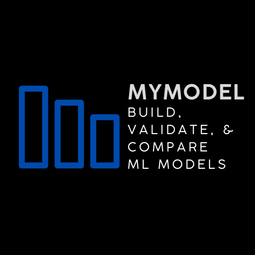

# MyModel

> An open-source no-code platform for building, validating, and comparing machine learning models.

**This project aims to enable a seamless interface for testing ML solutions**

---

### Core Features

1. Login to save/retrieve ML models
2. Upload csv data files
3. Run machine learning models
4. Compare models

---

### To Do List

**Model Building**

- [] Add option to drop nulls
- [] Add option to standardize variables
- [] Add option to run train/test split
- [] Add option to run cross-validation
- [] Add support for more complex models
  - [] SVM
  - [] Neural Networks

**User Interface**

- [] Compare Page
- [] Learn Page

**Backend**

- [] Fix CSRF Issue
